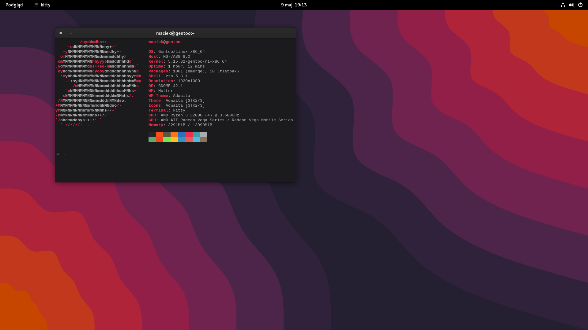
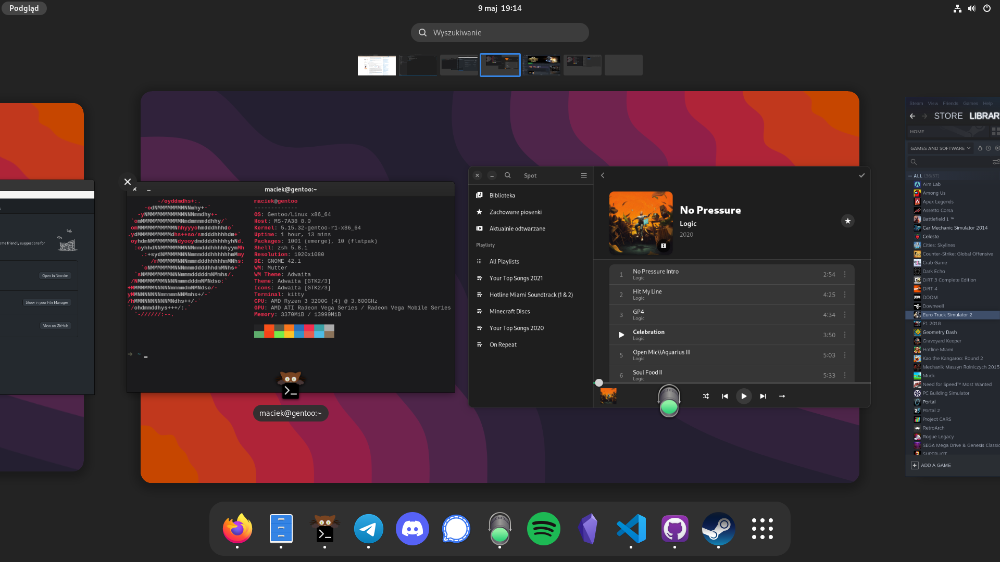

# dotfiles-gentoo
Config for my PC with Ryzen 3 3200G (--march=znver2)  
General Gentoo setup:  
    - systemd  
    - desktop/gnome/systemd profile  
    - GNOME packages with accept_keywords = ~amd64  
    - Flatpak for some desktop apps  
    - Bloat  
    - MTP and iOS support  
    - kitty as default terminal with FiraCode Nerd font  

## Configs overview  
### zsh  
Default shell is zsh. I use following aliases:  
```fd``` is ```find```  
```cat``` is ```bat```  
```ls``` is ```exa --icons``` (nerd font required)  
```vim``` is ```nvim```  
```gedit``` is ```gnome-text-editor```  
  
Shortcuts:
```l```   = ```lsd -l```  
```ll```  = ```lsd -la```  
```lt```  = ```lsd --tree```  
```cn```  = ```clear; neofetch```  
```cl```  = ```clear; lsd -l```  
```cll``` = ```clear; lsd -la```  
```clt``` = ```clear; lsd --tree```  
```ccd``` = ```clear; cd```  
  
Emerge stuff:  
```update``` to update system (with ```emaint sync -a``` and depclean)  
```ei``` to install package (with arguments -avq)  
```es``` to search for package  
  
### neofetch
Standard config for now  
  
### gtk-3.0
Enable dark mode  

### kitty
FiraCode Nerd font  
Font size: 10  
Set display server to x11 (window decorations on wayland are pretty bad)  
Remember window size  
Underline cursor  
Color scheme: FrontEndDelight  
Other minor tweaks  
  
### grub
Prepared config for plymouth and custom theme  
  
### portage
march = znver2  
```conf
USE="-kde -qt5 -qt4 -qt6 -emacs gnome gtk flatpak X pulseaudio alsa bluetooth dbus ffmpeg flac \
	fontconfig git ios mtp ipod java zsh-completion"
```  
efi-64 grub  
Mirrors setup for Poland  
Makeopts -j4  
Accept all licenses  
~amd64 keyword for gnome and steam  
Random useflags for some packages (portage was complaining)  

## Screenshots
  
  
